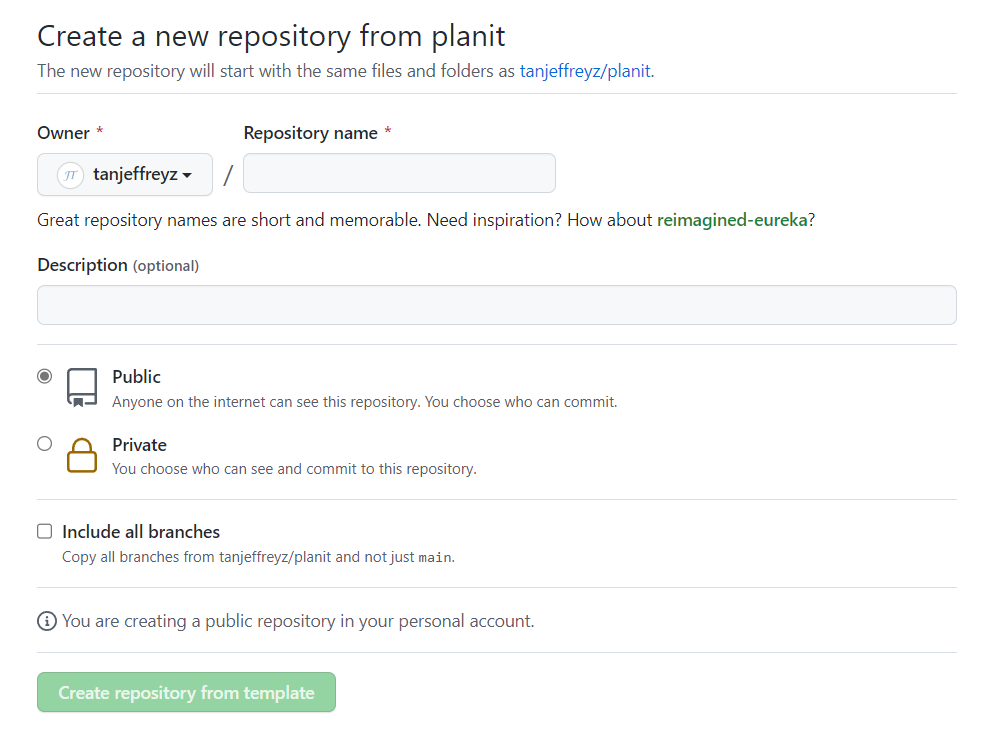

    
    <h1>Planit</h1>

Planit is an assignment tracker for students that compiles due dates into an interactive, minimalist calendar. Because some online homework platforms such as Gradescope don't have an API for students, web scraping is required to retrieve information about assignments. **HTTPs requests** are used alongside `BeautifulSoup` to perform this web scraping, which is automatically executed many times a day using **GitHub Actions**.

    <h2>Setup Instructions</h2>

<ol>
    <li>
        Log into GitHub or <a href="https://github.com/join"><b>create a new GitHub account</b></a>
    </li>
    <li>
        Click  at the top of this page, which should bring up the following prompt:
        

            
        

    </li>
    <li>
        Enter a name for the new repository. Keep in mind that this name will be used in the URL for your personal <b>Planit</b> webpage, so it's best to keep it short and memorable, like "planit". Then, click 
    </li>
</ol>
