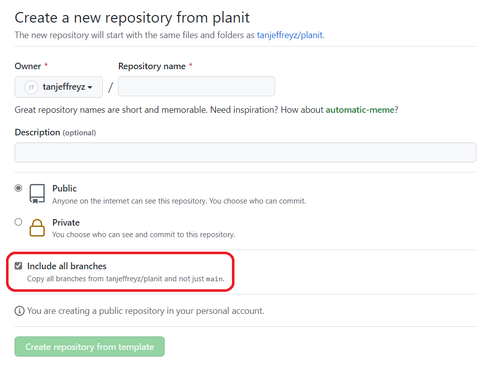
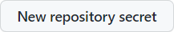
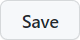
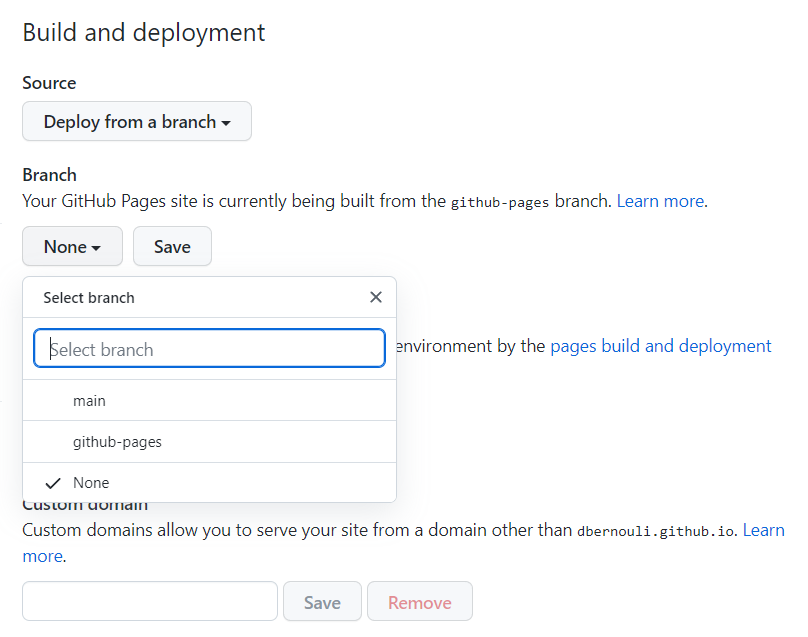

<div align="center">
    
    <h1>Planit</h1>
</div>

An assignment tracker for students that compiles due dates into an interactive, minimalist calendar. Because 
some online homework platforms such as Gradescope don't have an API for students, web scraping is required to retrieve 
information about assignments. **HTTP requests** are used alongside **Beautiful Soup** to perform this web scraping, 
which is automatically executed multiple times a day using **GitHub Actions**.

<div align="center">
    <a href="https://tanjeffreyz.github.io/planit"><b>Click here to see an example</b></a>
</div>
<br>


## One-time Setup Instructions
1. Log into GitHub or <a href="https://github.com/join"><b>create a new GitHub account</b></a> if you don't have one.

2. Click <a href="#"></a> at the top of this page, 
which should open the following prompt. <b>Make sure "Include all branches" is checked:</b>
<div align="center">
    
</div>

3. Enter a name for the new repository. Keep in mind that this name will be used in the URL for your personal 
<b>Planit</b> webpage, so it's best to keep it short and memorable, like "planit". 
Then, click <a href="#"></a>.

4. Visit your new repository's secrets at the following link:
```
https://github.com/YOUR_USERNAME/REPOSITORY_NAME/settings/secrets/actions
```

5. For each homework platform you use, create two new 
<a href="https://docs.github.com/en/actions/security-guides/encrypted-secrets">GitHub secrets</a>: 
one for your username and one for your password. A new secret can be created by clicking 
<a href="#"></a>. 
<b>For the secret's "Name" field, you must only use the values listed below.
In the "Secret" field, enter either your username or password depending on the value you chose for the "Name" field.</b>

<table align="center">
    <tr><th align="center">Username</th><th align="center">Password</th></tr>
    <tr align="center"><td>GRADESCOPE_USER</td><td>GRADESCOPE_PASSWORD</td></tr>
</table>

6. Next, go to the following link:
```
https://github.com/YOUR_USERNAME/REPOSITORY_NAME/settings/pages
```

7. In the dropdown menu under "Branch", select "github-pages" and click
<a href="#"></a>:
<div align="center">
    
</div>

8. Lastly, using the file navigation in your repository's home page, go to `data/assignments.js`, **delete** the file, and click 
<a href="#"></a>. 

<br>

That's it! <b>Planit</b> will start retrieving assignment information roughly once every hour and update your 
personal planner at the link below, which you can visit (and bookmark!) on any of your devices.
```
https://YOUR_USERNAME.github.io/REPOSITORY_NAME
```
